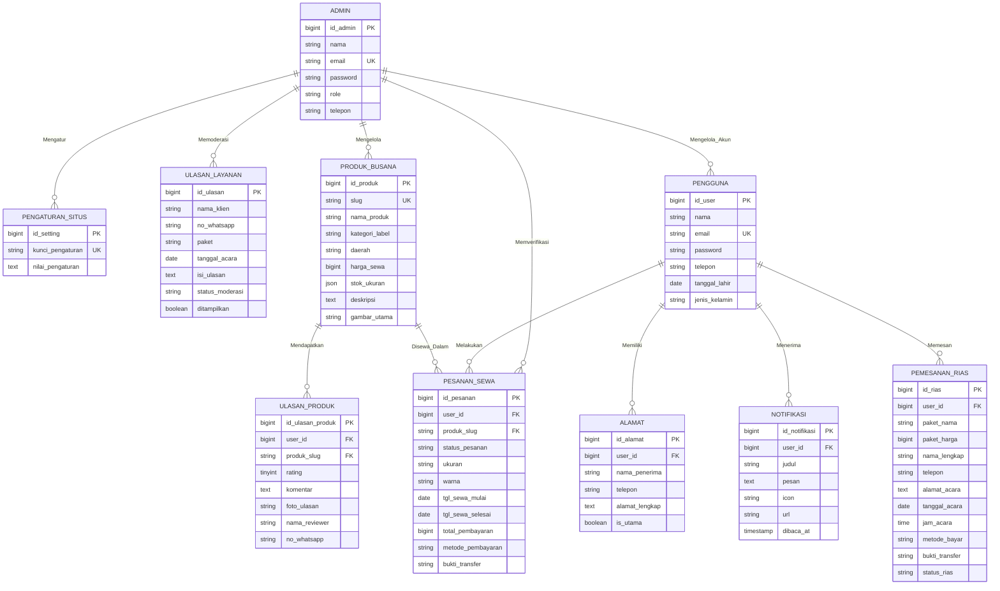

# Entity Relationship Diagram (ERD) - Butik Dayu
**Model Konseptual Basis Data (Notasi Peter Chen & Relasional)**

Dokumen ini menyajikan pemodelan basis data **ERD Butik Dayu** yang dirancang khusus mengikuti gaya dan notasi seperti diagram contoh referensi:
- **Tema Visual**: Dark mode (latar belakang gelap, garis putih/terang, tipografi kontras tinggi).
- **Notasi Peter Chen**:
  - **Entitas** dilambangkan dengan **Persegi Panjang** (`[Entitas]`).
  - **Relasi / Hubungan** dilambangkan dengan **Belah Ketupat (Diamond / Rhombus)** (`<Relasi>`).
  - **Atribut** dilambangkan dengan **Elips / Oval** (`(Atribut)`).
  - **Primary Key (PK)** ditandai dengan **teks yang digarisbawahi (<u>underlined</u>)**.
  - **Derajat Kardinalitas** (`1`, `N`) tertera jelas pada garis penghubung.

---

## 1. File Diagram yang Dihasilkan

| Jenis File | Lokasi File | Deskripsi & Kegunaan |
| :--- | :--- | :--- |
| **Interactive HTML** | [`erd_butik_dayu.html`](file:///c:/xampp/htdocs/Butik_Dayu/erd_butik_dayu.html) | Viewer interaktif (Zoom, Pan, Filter cluster, tombol **Download SVG** & **Download PNG HD** untuk skripsi/laporan). |
| **Draw.io Native (.drawio)** | [`erd_butik_dayu.drawio`](file:///c:/xampp/htdocs/Butik_Dayu/erd_butik_dayu.drawio) | File diagram asli Draw.io / diagrams.net yang dapat diedit langsung (geser kotak, ubah teks, ganti style). |
| **Draw.io XML** | [`erd_butik_dayu.drawio.xml`](file:///c:/xampp/htdocs/Butik_Dayu/erd_butik_dayu.drawio.xml) | File XML murni Draw.io untuk kompatibilitas impor ke berbagai platform. |
| **Vektor SVG HD** | [`erd_butik_dayu.svg`](file:///c:/xampp/htdocs/Butik_Dayu/erd_butik_dayu.svg) | Gambar vektor resolusi tinggi, siap dibuka di browser atau diimpor ke Word/Docs/Canva/Figma. |
| **Dokumentasi Markdown** | [`ERD_BUTIK_DAYU.md`](file:///c:/xampp/htdocs/Butik_Dayu/ERD_BUTIK_DAYU.md) | Dokumentasi tertulis lengkap untuk kebutuhan bab laporan / modul basis data. |

---

## 2. Struktur Visual ERD (Notasi Peter Chen)

```
                       +-------------------------+
                       |      (id_setting)       |
                       |   (kunci_pengaturan)    |
                       |   (nilai_pengaturan)    |
                       +------------+------------+
                                    |
                         [ Pengaturan_Situs ]
                                    |
                                    N
                               < Mengatur >
                                    1
                                    |
+-----------------------------------+-----------------------------------+
|                            [ Admin ]                                  |
|            Atribut: <u>id_admin</u>, nama, email, password, role, telepon    |
+---------+-------------------------+-------------------------+---------+
          | 1                       | 1                       | 1
     < Mengelola >            < Memverifikasi >        < Mengelola_Akun >
          | N                       | N                       | N
          v                         v                         v
+-------------------+      +-----------------+      +-------------------+
|  Produk_Busana    |      |  Pesanan_Sewa   |      |     Pengguna      |
| (<u>id_produk</u>,slug,   | (<u>id_pesanan</u>,     | (<u>id_user</u>, nama,    |
| nama_produk,kategori,     | status, ukuran, |      | email, password,  |
| daerah,harga_sewa,        | warna,tgl_sewa, |      | telepon,tgl_lahir,|
| stok_ukuran,deskripsi,    | total,metode,   |      | jenis_kelamin)    |
| gambar_utama)     |      | bukti_transfer) |      +---------+---------+
+----+----------+---+      +--------+--------+                |
     |          |                   |                         | 1
   1 |          | 1                 | N                  < Memesan >
< Mendapatkan > |              < Melakukan >                  |
     |          +--- 1 ---+         |                         v N
     v N                  |         |               +-------------------+
+---------------+         |         |               |  Pemesanan_Rias   |
| Ulasan_Produk |    < Disewa_Dalam >               | (<u>id_rias</u>, paket,   |
| (<u>id_ulasan_</u>,   |         |                         | harga, nama, tgl, |
| rating,       |         v N                       | jam, alamat, bayar|
| komentar,     |   [ Pesanan_Sewa ]                | status_rias)      |
| foto, reviewer)                                   +-------------------+
+---------------+

* Pengguna juga terhubung ke:
  - [ Pengguna ] --1--- <Memiliki> ---N--- [ Alamat ] (<u>id_alamat</u>, nama_penerima, telepon, alamat, is_utama)
  - [ Pengguna ] --1--- <Menerima> ---N--- [ Notifikasi ] (<u>id_notifikasi</u>, judul, pesan, icon, url, dibaca_at)
* Admin juga terhubung ke:
  - [ Admin ] --1--- <Memoderasi> ---N--- [ Ulasan_Layanan ] (<u>id_ulasan</u>, nama_klien, paket, tgl, ulasan, status, tampil)
```

---

## 3. Kamus Data: Entitas & Atribut

Berikut adalah rincian 10 entitas yang menyusun sistem Butik Dayu beserta atributnya:

### 1. Entitas: `Admin`
Aktor internal butik yang bertugas mengelola katalog busana, memvalidasi bukti pembayaran sewa, mengonfirmasi booking perias, dan memoderasi testimoni.
* `id_admin` **(PK, BigInt, Underline)**: Identifier unik admin.
* `nama` (Varchar): Nama lengkap staf/admin butik.
* `email` (Varchar, Unique): Alamat email untuk autentikasi login.
* `password` (Varchar): Kata sandi terenkripsi (Bcrypt/Argon2).
* `role` (Enum): Hak akses pengguna (`admin`).
* `telepon` (Varchar): Nomor WhatsApp/telepon admin yang bertugas.

### 2. Entitas: `Pengguna` (User / Customer)
Pelanggan yang menyewa busana adat atau memesan jasa rias pengantin.
* `id_user` **(PK, BigInt, Underline)**: Identifier unik pelanggan.
* `nama` (Varchar): Nama lengkap penyewa.
* `email` (Varchar, Unique): Email pelanggan untuk akun & verifikasi.
* `password` (Varchar): Kata sandi akun.
* `telepon` (Varchar): Nomor WhatsApp aktif untuk konfirmasi sewa & pengantaran.
* `tanggal_lahir` (Date): Tanggal lahir pelanggan.
* `jenis_kelamin` (Varchar): Jenis kelamin (`laki-laki` / `perempuan`).

### 3. Entitas: `Alamat`
Daftar alamat pengiriman yang dapat disimpan oleh pelanggan.
* `id_alamat` **(PK, BigInt, Underline)**: Identifier unik alamat.
* `nama_penerima` (Varchar): Nama penerima paket busana adat.
* `telepon` (Varchar): Nomor telepon penerima saat kurir mengantar.
* `alamat_lengkap` (Text): Detail jalan, nomor rumah, RT/RW, kecamatan, kota, kode pos.
* `is_utama` (Boolean): Penanda apakah alamat ini adalah alamat utama (default).

### 4. Entitas: `Produk_Busana` (Koleksi Pakaian Adat)
Katalog busana tradisional dari berbagai daerah nusantara (Jawa, Sunda, Bali, Minang, Toraja, Bugis).
* `id_produk` **(PK, BigInt, Underline)**: Identifier unik produk.
* `slug` (Varchar, Unique): URL ramah SEO produk (misal: `solo-basahan`, `sunda-siger`).
* `nama_produk` (Varchar): Nama pakaian adat.
* `kategori_label` (Varchar): Label kategori adat (misal: "Baju Adat Jawa").
* `daerah` (Varchar): Asal daerah busana.
* `harga_sewa` (BigInt): Tarif sewa pakaian per periode.
* `stok_ukuran` (JSON): Ketersediaan stok per variasi ukuran (`S`, `M`, `L`, `XL`, `Anak`).
* `deskripsi` (Text): Rincian bahan, kelengkapan aksesoris, & filosofi adat.
* `gambar_utama` (Varchar): Path/URL foto utama katalog busana.

### 5. Entitas: `Pesanan_Sewa`
Transaksi penyewaan pakaian adat oleh pelanggan.
* `id_pesanan` **(PK, BigInt, Underline)**: Nomor transaksi sewa.
* `status_pesanan` (Enum): Status pesanan (`menunggu_konfirmasi`, `pembayaran_berhasil`, `selesai`, `dibatalkan`).
* `ukuran` (Varchar): Ukuran busana yang dipilih (`S`, `M`, `L`, `XL`).
* `warna` (Varchar): Varian warna busana (misal: `Gold`, `Maroon`, `White`).
* `tgl_sewa_mulai` (Date): Tanggal mulai pemakaian/penyewaan.
* `tgl_sewa_selesai` (Date): Tanggal batas pengembalian pakaian adat.
* `total_pembayaran` (BigInt): Total tagihan sewa.
* `metode_pembayaran` (Enum): Metode pembayaran (`transfer` atau `cod`).
* `bukti_transfer` (Varchar): File path foto struk transfer yang diunggah pelanggan.

### 6. Entitas: `Pemesanan_Rias`
Transaksi booking jasa tata rias pengantin / wisuda / acara adat di lokasi pelanggan.
* `id_rias` **(PK, BigInt, Underline)**: Nomor booking jasa rias.
* `paket_nama` (Varchar): Nama paket (misal: *Paket Akad*, *Paket Resepsi*, *Pre-Wedding*).
* `paket_harga` (BigInt): Biaya paket rias.
* `nama_lengkap` (Varchar): Nama pemesan / mempelai.
* `telepon` (Varchar): Nomor kontak yang bisa dihubungi pada hari-H.
* `alamat_acara` (Text): Lokasi gedung / rumah pelaksanaan rias.
* `tanggal_acara` (Date): Tanggal pelaksanaan jasa rias.
* `jam_acara` (Time): Waktu mulainya pengerjaan tata rias.
* `metode_bayar` (Varchar): Metode pembayaran DP atau lunas (`transfer`).
* `bukti_transfer` (Varchar): File bukti bayar.
* `status_rias` (Varchar): Status layanan (`menunggu_verifikasi`, `dikonfirmasi`, `selesai`, `dibatalkan`).

### 7. Entitas: `Ulasan_Produk`
Ulasan dan penilaian bintang untuk pakaian adat yang disewa.
* `id_ulasan_produk` **(PK, BigInt, Underline)**: Identifier unik ulasan produk.
* `rating` (TinyInt): Skor penilaian (1 hingga 5 bintang).
* `komentar` (Text): Testimoni penyewa mengenai kualitas kain, kebersihan, dan kerapian baju.
* `foto_ulasan` (Varchar): Foto riil pemakaian baju oleh pelanggan.
* `nama_reviewer` (Varchar): Nama pelanggan yang mengulas.
* `no_whatsapp` (Varchar): Nomor telepon reviewer.

### 8. Entitas: `Ulasan_Layanan` (Testimoni Umum Butik)
Testimoni pengalaman menggunakan layanan butik & jasa rias secara umum.
* `id_ulasan` **(PK, BigInt, Underline)**: Identifier unik testimoni butik.
* `nama_klien` (Varchar): Nama klien pemberi ulasan.
* `no_whatsapp` (Varchar): Nomor kontak klien.
* `paket` (Varchar): Paket yang dipesan (akad / resepsi / pre-wedding).
* `tanggal_acara` (Date): Waktu terselenggaranya acara.
* `isi_ulasan` (Text): Pesan kepuasan pelanggan terhadap perias & staf butik.
* `status_moderasi` (Varchar): Status persetujuan admin (`menunggu`, `disetujui`).
* `ditampilkan` (Boolean): Flag penentu apakah ulasan dipajang di landing page (`0` = sembunyi, `1` = tampil).

### 9. Entitas: `Notifikasi`
Sistem notifikasi dinamis untuk memberitahukan status pesanan kepada pelanggan.
* `id_notifikasi` **(PK, BigInt, Underline)**: Identifier notifikasi.
* `judul` (Varchar): Judul notifikasi (misal: "Pesanan Berhasil Dibuat", "Pembayaran Berhasil").
* `pesan` (Text): Isi pesan notifikasi.
* `icon` (Varchar): Jenis ikon visual (`pesan`, `pengiriman`, `batal`, `koleksi`).
* `url` (Varchar): Tautan langsung ke tab riwayat pesanan.
* `dibaca_at` (Timestamp): Waktu ketika notifikasi dibuka oleh pelanggan.

### 10. Entitas: `Pengaturan_Situs`
Konfigurasi profil butik dan landing page dinamis.
* `id_setting` **(PK, BigInt, Underline)**: Identifier setting.
* `kunci_pengaturan` (Varchar): Kunci konfigurasi (`whatsapp`, `instagram`, `hero_judul`, `jam_operasional`, dll.).
* `nilai_pengaturan` (Text): Nilai teks atau link konfigurasi.

---

## 4. Matriks Relasi & Kardinalitas

| No | Relasi | Entitas 1 | Kardinalitas | Entitas 2 | Penjelasan Logis |
| :---: | :--- | :--- | :---: | :--- | :--- |
| **1** | **Mengatur** | `Admin` | `1 : N` | `Pengaturan_Situs` | Satu admin dapat mengonfigurasi banyak parameter situs butik. |
| **2** | **Memoderasi** | `Admin` | `1 : N` | `Ulasan_Layanan` | Admin memvalidasi dan menyetujui ulasan testimoni sebelum tampil ke publik. |
| **3** | **Mengelola** | `Admin` | `1 : N` | `Produk_Busana` | Admin bertugas menambah, mengedit foto, harga, dan stok ukuran busana. |
| **4** | **Memverifikasi** | `Admin` | `1 : N` | `Pesanan_Sewa` | Admin memverifikasi keabsahan bukti bayar dan mengubah status sewa. |
| **5** | **Mengelola_Akun** | `Admin` | `1 : N` | `Pengguna` | Admin memiliki kendali untuk mengelola data akun pengguna terdaftar. |
| **6** | **Disewa_Dalam** | `Produk_Busana` | `1 : N` | `Pesanan_Sewa` | Satu produk busana adat dapat disewa dalam banyak transaksi pesanan. |
| **7** | **Melakukan** | `Pengguna` | `1 : N` | `Pesanan_Sewa` | Satu pelanggan dapat melakukan transaksi penyewaan berkali-kali. |
| **8** | **Memiliki** | `Pengguna` | `1 : N` | `Alamat` | Satu pengguna dapat mendaftarkan beberapa alamat pengiriman busana. |
| **9** | **Menerima** | `Pengguna` | `1 : N` | `Notifikasi` | Satu pengguna menerima banyak riwayat notifikasi status pesanan. |
| **10** | **Mendapatkan** | `Produk_Busana` | `1 : N` | `Ulasan_Produk` | Satu pakaian adat mendapatkan banyak ulasan rating dari para penyewa. |
| **11** | **Memesan** | `Pengguna` | `1 : N` | `Pemesanan_Rias` | Pelanggan dapat memesan satu atau beberapa jadwal jasa tata rias pengantin. |

---

## 5. Diagram ERD Mermaid (Alternatif Format Kode)


